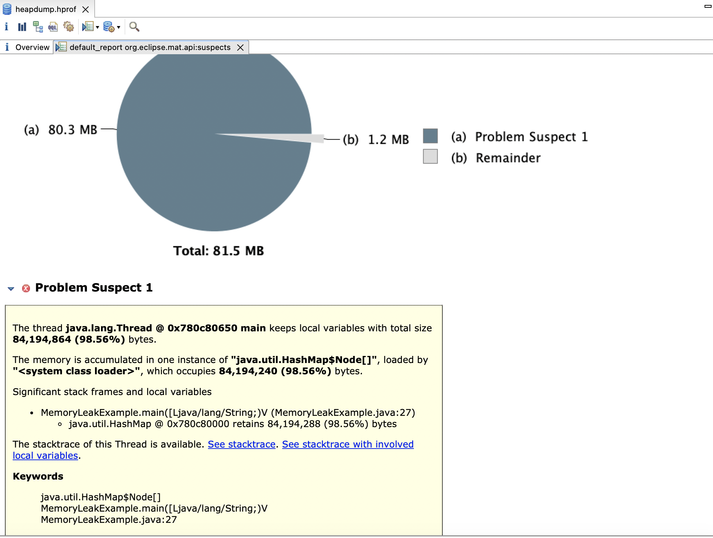

# Exercise 2: Java Memory Leak and Analysis

## Problem Statement

This exercise demonstrates a memory leak in Java, explains how to retrieve a heap dump, and provides steps to analyze it. It also covers strategies to avoid memory leaks in real-world applications.

---

## Code Description

The code in `MemoryLeakExample.java` simulates a memory leak by using a `HashMap` to store objects indefinitely. The `UniqueKey` class is implemented as a `record`, which ensures proper handling of `equals` and `hashCode` methods automatically. However, the objects stored in the map are never removed, causing memory consumption to grow until the application runs out of memory.

### Key Features:
- The `HashMap` grows continuously, holding references to all its keys and values.
- The application runs indefinitely, allowing you to observe memory usage and generate heap dumps.
- The `record` feature in Java is used to define `UniqueKey` efficiently.
- MAT screenshot `memory-leak-screenshot.png` included.

---

## How to Run the Code

> **Note**: This program uses `record`, a feature introduced in Java 14. Ensure you have Java 14 or higher installed.

1. **Compile the program**:
   ```bash
   javac MemoryLeakExample.java
   ```

2. **Run the program with JVM options to generate a heap dump**:
   ```bash
   java MemoryLeakExample
   ```

3. **Monitor memory usage**:
    - Observe memory consumption using tools like your system's process manager (`ps` on Linux/Mac, Task Manager on Windows).
    - Allow the application to run until it throws an `OutOfMemoryError`.

---

## How to Retrieve a Heap Dump

### 1. Automatic Heap Dump on OutOfMemoryError
- Use the JVM option 
`-XX:+HeapDumpOnOutOfMemoryError` 
to automatically generate a `heapdump.hprof` file when the application runs out of memory:
  ```bash
  java -XX:+HeapDumpOnOutOfMemoryError -XX:HeapDumpPath=heapdump.hprof MemoryLeakExample
  ```

### 2. Manual Heap Dump
- Use the `jmap` tool to manually trigger a heap dump:
  ```bash
  jmap -dump:live,format=b,file=heapdump.hprof <PID>
  ```
  Replace `<PID>` with the process ID of your Java application. You can find the PID using:
    - `jps` (Java process status tool) or
    - `ps aux | grep java` on Unix/Linux/Mac.

### 3. Use Monitoring Tools
- **VisualVM**:
    - Attach to the Java process, then navigate to the "Monitor" tab and click "Heap Dump".
- **Java Mission Control (JMC)**:
    - Attach to the running process and create a heap dump via the Memory tab.
---

## How to Analyze a Heap Dump

Use a tool like **Eclipse Memory Analyzer (MAT)** to analyze the `heapdump.hprof` file:

1. **Open the Heap Dump in MAT**:
    - Launch MAT and load the `heapdump.hprof` file.

2. **Run the Leak Suspect Report**:
    - This report identifies objects retaining a large portion of memory and suggests potential leaks.

3. **Look for Problematic Objects**:
    - Check objects with unusually large retained sizes.
    - Focus on collections (`HashMap`, `ArrayList`) that grow excessively.

4. **Analyze Reference Chains**:
    - MAT provides paths to objects that prevent garbage collection. This helps identify why objects remain in memory.

## Memory Leak Analysis

Below is an example of the memory leak analysis from Eclipse Memory Analyzer (MAT):



---

## Avoiding Memory Leaks

### What is a Memory Leak?
A memory leak in Java occurs when objects that are no longer needed remain referenced, preventing the garbage collector from reclaiming their memory.

### Strategies to Avoid Memory Leaks

1. **Remove Objects from Collections**:
    - Ensure objects are removed from collections when no longer needed.
      ```java
      map.remove(key);
      ```

2. **Use Weak References**:
    - Use `WeakHashMap` or weak references for cache-like structures where keys/values should not prolong object lifetimes.
      ```java
      Map<UniqueKey, String> cache = new WeakHashMap<>();
      ```

3. **Avoid Static Collections**:
    - Avoid using static fields to store large collections, as these objects can live for the lifetime of the application.

4. **Close Resources Properly**:
    - Always close files, streams, and database connections using try-with-resources:
      ```java
      try (FileInputStream fis = new FileInputStream("file.txt")) {
          // Read from the file
      }
      ```

5. **Profile Applications Regularly**:
    - Use tools like MAT or VisualVM during development and testing to identify memory leaks early.

---

## Summary

- **Implementation**: The `MemoryLeakExample` program demonstrates a leak using a `HashMap` that retains references to its keys indefinitely.
- **Heap Dump**: You can retrieve a heap dump using JVM options or tools like `jmap`.
- **Analysis**: Use tools like Eclipse MAT to identify and analyze memory leaks in the application.
- **Prevention**: Apply best practices such as weak references, proper resource management, and regular profiling to avoid memory leaks in Java applications.
